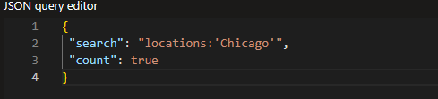
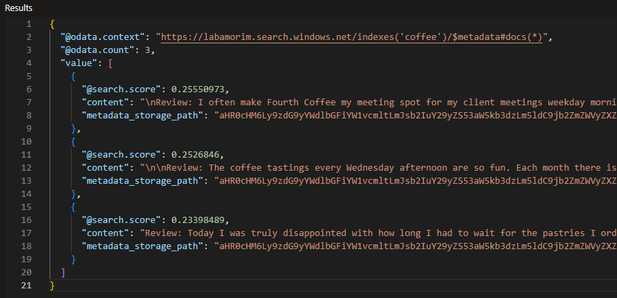

# 📈 Microsoft-Azure-Search

## 🔍 How Use

- First you create your account on Microsoft: Azure, after this we can create a new Resource and try this AI.

- Just read the documentation to do this.

## 🤓 Possibility

- With this we can control our resources.

## ✍️ Test

- After we create our project we go to prompt to search:

Input:

Output:

## 📖 Documentation

- [**Microsoft: Azure doc**](https://microsoftlearning.github.io/mslearn-ai-fundamentals/Instructions/Labs/11-ai-search.html)

- [**DIO Class**](https://www.dio.me/)